[[snippet]]
| In my second year at University (2011) studying Computer Science, I decided I’d start making a game. I’ve always intended to get into game design/development so I figured now that I was actually learning to program, I should put these skills into practice. Here is the very first screenshot I took of it:
|
| 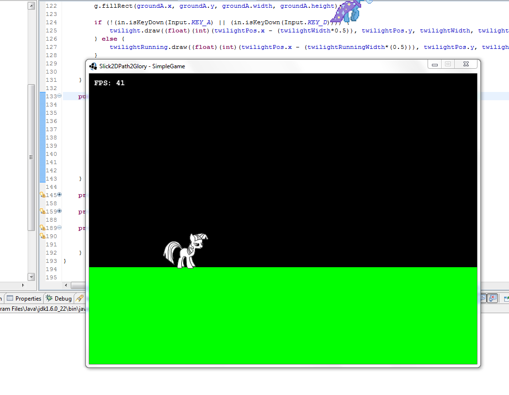
|
| Even at this point it was already clear that collision handling was relevant. I actually wrote some code for this to allow the player to move and jump around on this rectangle. However, the difference between handling the collisions of a player with a fully-developed level and one constant sized rectangle is colossal.
|
| At first, Collision  Handling and Collision Detection don’t seem like different things. I know certainly going into this project that my own reasoning was that as long as the player and everything in the level was represented by a rectangle, it should be fairly trivial to detect when these shapes are intersecting, especially when the engine I was using (as well as Java itself) featured a Rectangle.intersects() method for my convenience.
|
| That’s the trap.

It’s not until you sit down to actually develop this interaction that you have the fatal conversation with yourself: “Okay, so if the rectangles intersect then… they should… actually, I don’t know what they should do.”
It’s that moment you learn the difference between Collision Detection and Collision Handling.

Collision Detection, for the most part, is a simple calculation, even for complex shapes in multiple dimensions; it’s the Handling part that’s tricky. If two shapes are intersecting or are about to intersect, what steps do you take to make them

No-longer intersect?
Produce a satisfactory outcome for future interactions?
Allow me to briefly cover how this problem is generally handled most of the time. Observe the following diagram:

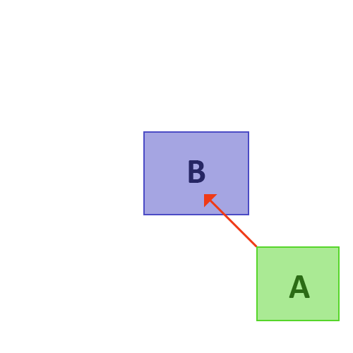

Rectangle A is attempting to move along the vector represented by the red arrow. If it does move to this position, it will intersect Shape B:

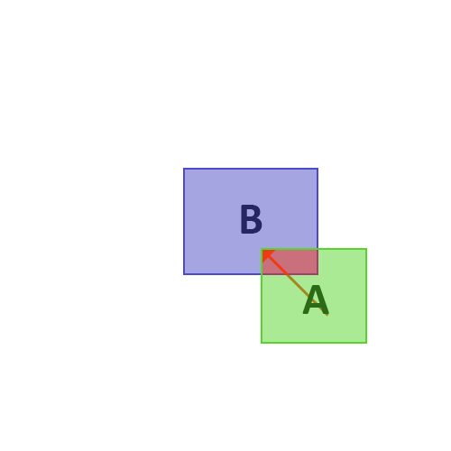

This collision has been detected, now to handle it. Traditionally, this will be handled in one of a few similar ways:

1.) “Rewind”

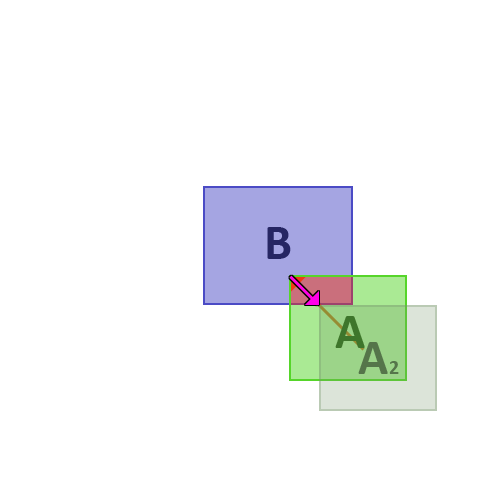

A2 is the result of handling the collision. In this method the shape is moved backward along it’s movement vector to a point where it no longer intersects. This has the problem of “freezing” the object upon collision. The only way for A to move at all is for it to move away from B, it can’t slide along the side of it. In this instance, if A were a player object and B were a wall, attempting to move Diagonally Up/Left would result in no movement. This type of solution is rarely ideal.

2.) “Fastest Escape”

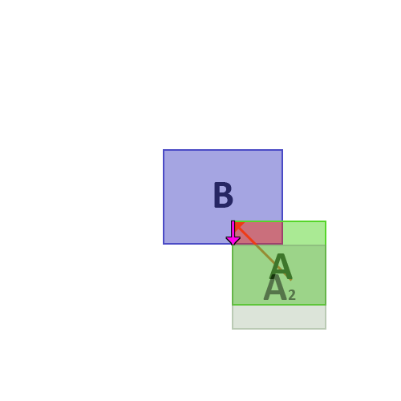

In method 2, the result A2 is found by computing the smallest distance required to leave the intersecting shape. In this case, A2 is found by moving A to the bottom edge of B. This, for the most part, solves the problem of getting stuck against an object, as it allows Shape A to slide along Shape B in an attempt to move Diagonally Up/Left. You can see that if Shape A persisted in this direction its result would be movement directly to the left (the upwards movement would be cancelled), until it cleared Shape B. Despite these solutions’ popularity, they are fundamentally flawed. Observe the following:

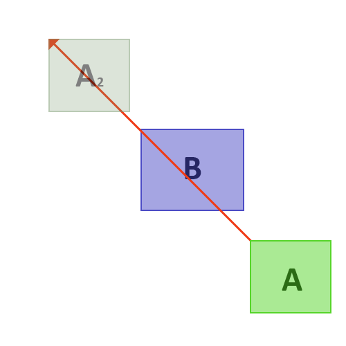

In this instance Shape A is moving VERY fast. So fast, in fact, the system will not detect any collision before or after movement. At neither of these points in time is A intersecting B, thus, these shapes did not collide. Systems that use this methodology suffer from the limitation of being unable to handle fast-moving objects. To counteract this, many Systems run these physics calculations on a separate timer, often much faster than the actual graphics or logic ticks. In our latest example this would result in Shape A’s intersection with B being calculated at multiple points along its vector which, in this case, would probably detect and correctly solve the collision. If your Engine needs to support very fast objects, you increase the rate of this tick to make for more accurate collisions, at the cost of extra processor utilisation. If you are unlucky enough to be working in an environment that cannot facilitate this behaviour (by being either underpowered or limited technologically - working in a single-threaded environment, for example) then you cannot overcome this problem.
Many years ago I asked a professional game developer how one may get around this problem. He told me that it could be solved using vector arithmetic. This makes sense, as vectors are continuous, not discrete, so theoretically one could use them to solve these collisions absolutely. As I was in my second year at university and had, at the time, already taken 2 or 3 mathematics papers featuring vectors, and their surrounding arithmetic, I figured I understood the mathematics enough to work out how to do this. I spent a long time thinking of different ways to achieve it; some ideas good, some bad. Eventually, the idea of how it would work formed in my head, as follows:

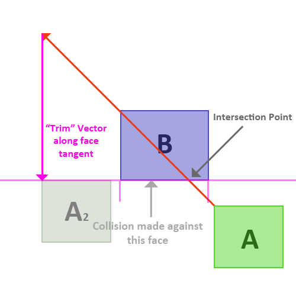

By testing for an intersection between A’s movement vector and each face of B, I could detect what face these shapes were going to collide along. I could then scale A’s movement vector appropriately to simulate a “collide-then-slide” result. It looks a bit counter-intuitive in this diagram as the result A2 isn’t actually touching any shapes. You have to remember that, in this instance, A’s movement vector is HUGE. If this were a game, A would be moving many times it’s own size per frame, which is a very high speed. This interaction represents, in-between frames, A colliding with B, then sliding off its bottom edge.

However, I immediately started to run into problems, mostly in the form of counter-examples breaking my logic. For starters, where does A’s movement vector even project from? It’s clear in this case that it should come from the top left corner, but if it were travelling Up-Right, the result would not be accurate. I decided this vector should project from all vertices in the shape, since you can’t really collide edge-to-edge, right? If two shapes are colliding at least one of them has to be Vertex-to-edge. Wrong. I quickly thought of this counter-example:

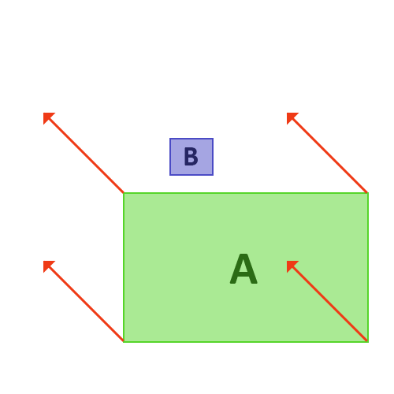

If Shape A were significantly bigger than B, it could move straight past it without any of its vertices ever colliding with an edge on B. I toyed around with projecting A’s movement vector backwards from B, but eventually realised that I needed to project both ways in order to guarantee a detection:

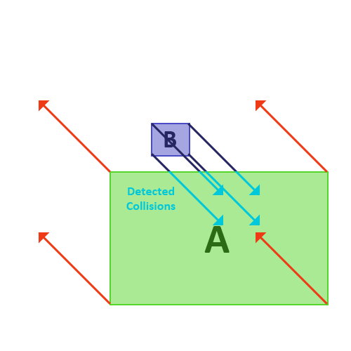

Now the system would be able to detect any collision between any shape, and I should point out that at this point I was still working with Polygons, not just Axis-Aligned Rectangles. Eventually the vector projection onto arbitrary edges made things too complex, and I had to settle on the restriction of purely using Axis-Aligned Rectangles. I may make a post solely on AABBs and their use in physics simulations at some point.

Now the system was doing really great, but I was still running into a few issues, mainly corner cases (literally). I was having troubles dealing with corner-to-corner collisions. This was a problem that stumped me for months, and caused me to restart my thought process from the beginning a couple of times. Every time I hoped to simplify the system so that I needn’t deal with problems caused by the corners, but every time they would show up and start causing problems anyway.

The first problem seems trivial, but it becomes important:

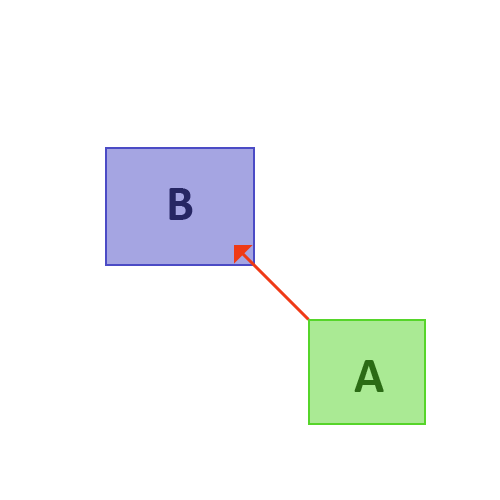

What happens in this case? It is indeterminate which faces of B A is colliding with, but I didn’t want to make allowances in my algorithm for this specific case. I wanted it to be treated like every other collision – ultimately it didn’t matter which side it went along, I was happy just as long as it went along one of the sides.

In comes the trouble:

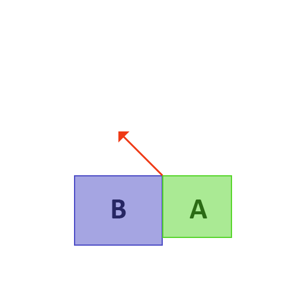

In this instance, all vertices in the system that return a collision will return a collision at length 0. However, we still have one that we want to pick as the “correct” result. The corner-to-corner collision at the top may pick the wrong side (as I had previously determined I didn’t care which side was picked in a corner-to-corner collision, just as long as a side was picked). In this scenario, the top-left corner of A and the top-right corner of B are colliding with each other (corner-to-corner collision), and the bottom-left corner of A is colliding with B’s right side. This is the telling factor; we want to make sure we only pick the result of a Corner-to-Corner collision if we have no other choice. So, in the algorithm, whenever a corner-to-corner collision occurs, we flag it as a “Corner” collision and add it to the results pool. When the results are sorted for choosing at the end of calculating, we look for the shortest non-corner collision; if no results are non-corner, then we just take the shortest in the list.

Now the system was doing great, it could handle collisions between any 2 objects in a stable manner, but in implementation a problem quickly arose.
Say Shape A is travelling like this, into 2 shapes:

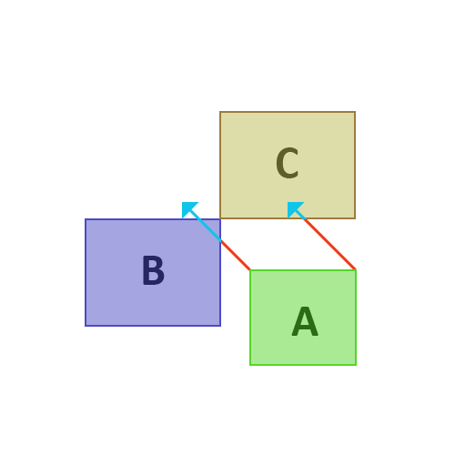

2 intersections are detected. It’s clear that the intersection with shape B is the shortest, so the algorithm picks that face to “slide” along. However, this produces an erroneous result:

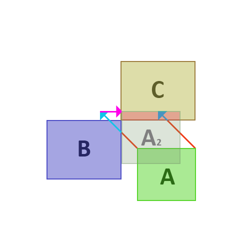

Result A2 has slid along the right face of Shape B after computing a collision, but is now intersecting with Shape C. We can’t take the result from Shape C either, since that would result in a collision with Shape B. The solution? Good old fashioned recursion. We re-call the whole algorithm again but this time, instead of making the request with the original request vector, we give it the result of the collision with B, like so:

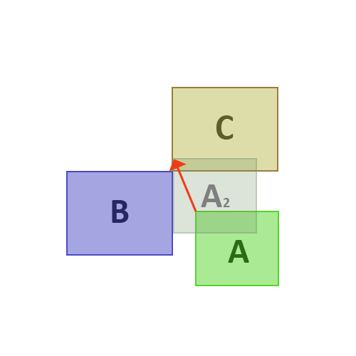

Since this result has been calculated from a collision with Shape B, we can be sure that any subsequent result of this vector will NOT intersect Shape B. This request does not intersect Shape B, so our intersection with Shape C is our only result, producing the following:

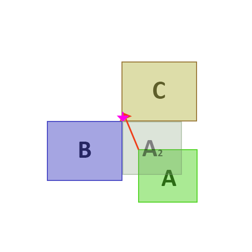

Which is the result we want, representing a collision with both shapes. This recursion stops when the requested vector is equal in length to the result vector (i.e. if we run this calculation one more time and no further collisions are detected).

That’s the algorithm in its entirety. It’s not a lot of code once it’s all worked out, but it’s taken me a long time to work out. I did originally do research into some pre-existing algorithms but never felt comfortable with them, and I didn’t feel like I truly understood them. This has been a great learning experience for me. It’s an algorithm I see myself using for all my 2D collision handling needs.

If you have any questions about this algorithm or would like to see some code implementations of it feel free to comment about it or message me. Although please note I wrote this post in 2013 😂

